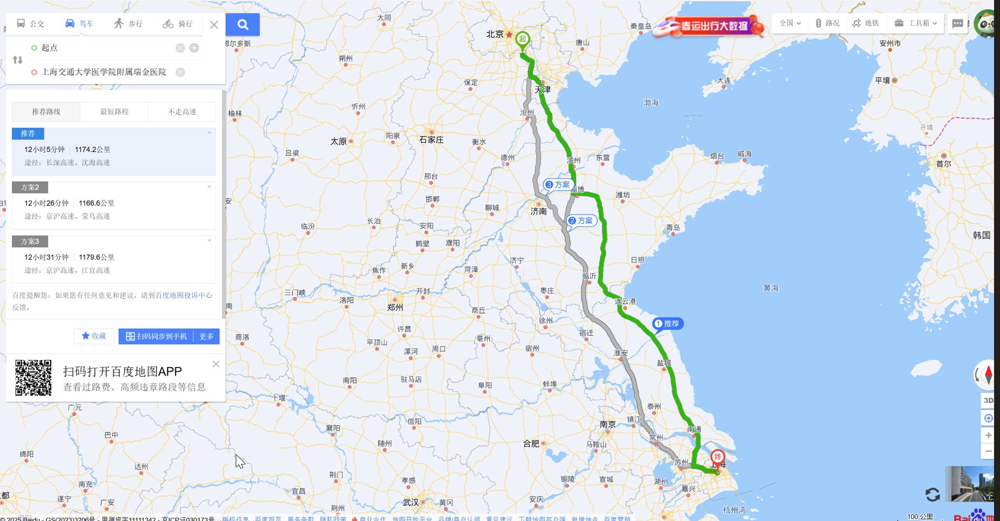
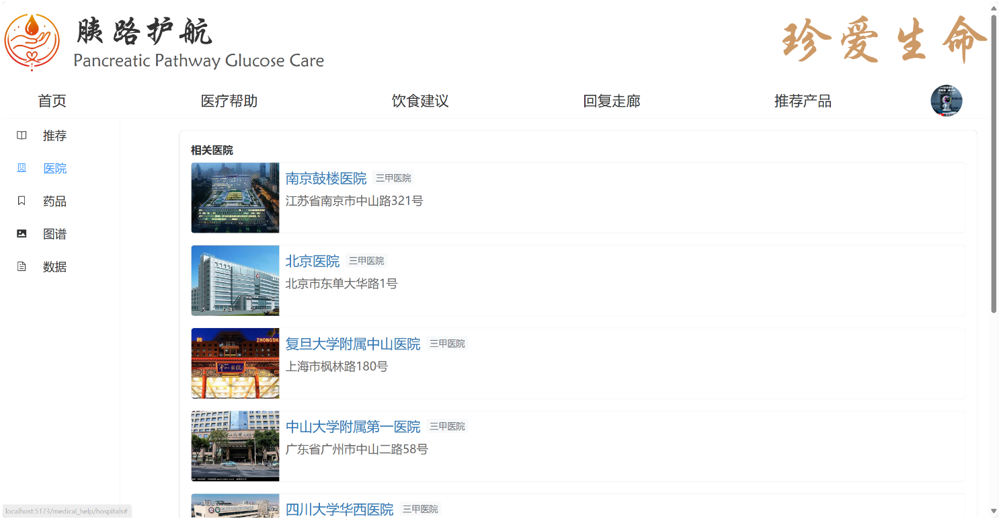
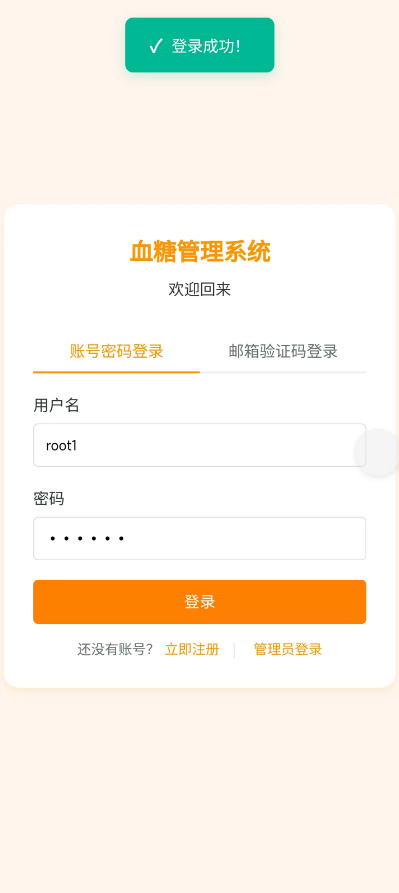
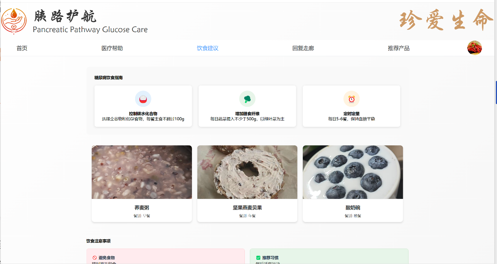
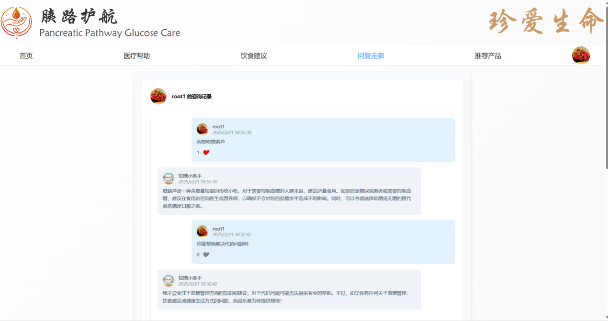
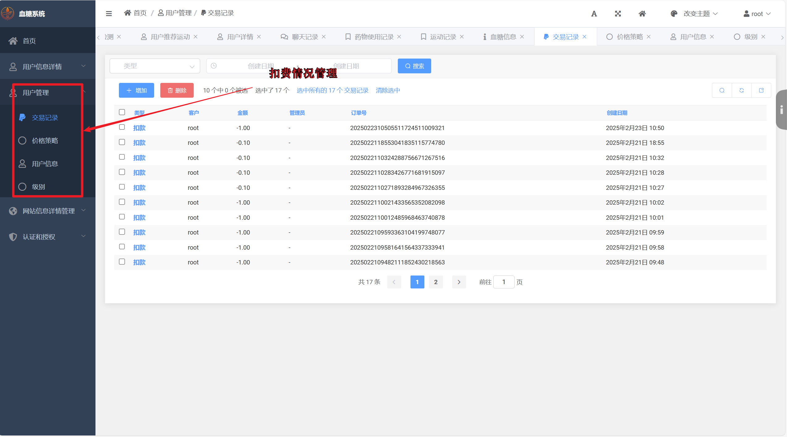
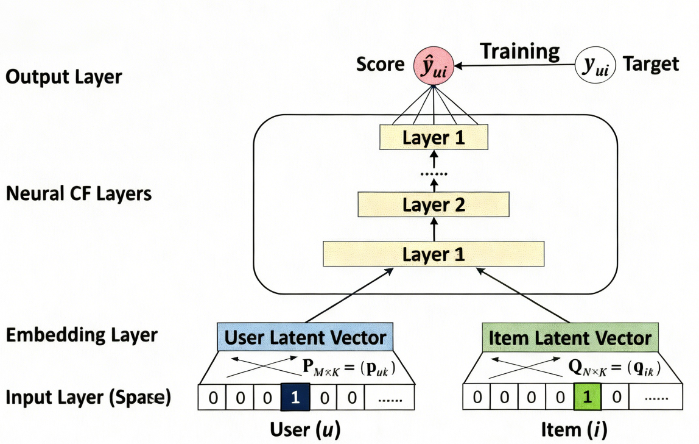
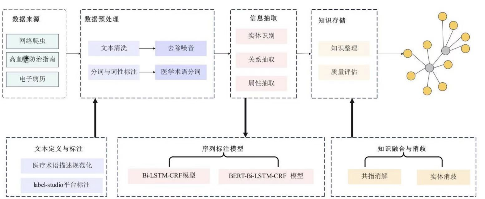
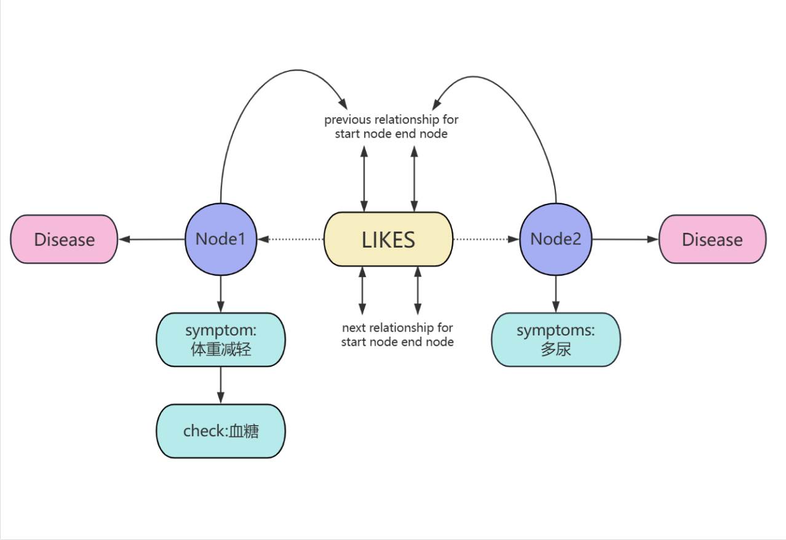

# 智护血糖 - AI 个性化控糖系统

<div align="center">

**慢病管理视角下的 AI 个性化控糖平台**

[](https://www.python.org/)
[](https://www.djangoproject.com/)
[](https://vuejs.org/)
[](https://www.mysql.com/)
[](https://neo4j.com/)
[](https://redis.io/)

</div>

## 项目概览

智护血糖是一套围绕糖尿病慢病管理设计的 AI 个性化控糖系统，覆盖 Web 信息平台、移动端健康管理、后台管理和智能问答服务。系统的核心目标不是简单做一个健康记录工具，而是把糖尿病患者日常管理中最常见的几个问题串成闭环：用户需要持续记录血糖、饮食、运动、用药等信息，需要理解糖尿病知识，需要在饮食和运动上获得更贴合自身情况的建议，也需要在异常状态出现时得到及时提醒。

项目整体从校园竞赛和科研实践中发展而来，既有完整的前后端功能，也有围绕糖尿病知识图谱、DeepSeek 问答、个性化推荐算法、后台管理、移动端体验的系统设计。它更适合作为一个“完整产品型校园项目”来展示，而不是单点功能 Demo。面试时可以从需求背景、业务闭环、技术架构、AI 能力、工程落地、协作经历和竞赛成果几个角度展开。

在这个项目中，我主要承担后端全栈和 AI 应用落地相关工作，包括 Django 后端业务、功能联调、用户健康数据管理、AI 问答与推荐能力接入、后台管理能力，以及 Web 端和移动端功能协同。项目对我最大的价值，是把课堂和竞赛中的算法、数据库、Web 开发、移动端页面、后台管理和产品展示串到同一个真实主题里，形成一段可以向面试官完整讲清楚的项目经历。

## 演示视频

[点击查看项目演示视频](https://blood-sugar.oss-cn-beijing.aliyuncs.com/%E6%BC%94%E7%A4%BA%E8%A7%86%E9%A2%91.mp4)

## 项目成果

- 传智杯全国 IT 技能大赛 Web 网页开发挑战赛 B 组国赛一等奖
- 获得“知糖助手平台 V1.0”计算机软件著作权
- 完成 Web 端、移动端、后台管理端和 AI 问答能力的完整闭环
- 结合糖尿病知识图谱、DeepSeek 问答和个性化推荐算法，探索慢病管理场景下的 AI 应用落地
- 形成了竞赛文档、系统演示视频、产品截图和项目仓库，可以支撑面试中的项目讲述


## 一句话介绍

智护血糖是一个面向糖尿病患者的多端健康管理系统，用户可以记录血糖、运动、用药、饮食等数据，系统通过知识图谱和 AI 问答提供糖尿病知识咨询，通过个性化推荐能力给出饮食和运动建议，后台管理端负责用户数据、内容、交易和推荐资源维护，最终形成从用户记录到智能反馈的慢病管理闭环。

## 项目背景

糖尿病尤其是 2 型糖尿病，是典型的长期慢病管理问题。它不是一次就诊就能解决的疾病，患者需要长期关注饮食、运动、血糖、用药、并发症风险和心理状态。传统管理方式常见的问题是数据分散、反馈滞后、个性化不足和专业知识获取门槛较高。很多患者知道要控制血糖，但不知道每天应该怎么吃、什么时候运动、哪些异常需要警惕，也缺少一个能持续记录和回顾健康变化的平台。

这个项目的出发点，是把糖尿病管理拆成几个具体场景：第一，用户需要方便地记录自己的血糖、运动、用药和饮食情况；第二，用户需要看到趋势，而不是只看到孤立的数据；第三，用户需要能问糖尿病相关问题，并得到尽量专业、可理解的回答；第四，系统需要能给出饮食和运动建议，帮助用户降低管理压力；第五，后台需要能维护医院、药品、科普文章、每日推荐食物、用户记录等基础数据，保证用户侧内容不是静态页面。

因此项目没有只做单一问答机器人，也没有只做一个记录页面，而是尝试做成“Web 信息平台 + 移动端健康管理 + 后台管理 + AI 能力”的完整系统。Web 端更偏信息展示和医疗资源入口，移动端更偏用户日常使用，后台管理端更偏运营和数据维护，AI 模块则承担智能问答、个性化建议和知识增强的角色。

## 我的职责

我在项目中更偏后端全栈和 AI 应用落地，重点关注系统能不能真正跑成一个完整链路，而不是只停留在页面展示。

- 负责 Django 后端核心业务设计，围绕用户、健康记录、文章内容、医院药品、商城支付、积分打卡等模块组织数据和服务能力。
- 负责 AI 问答与个性化推荐相关能力接入，围绕糖尿病知识图谱、DeepSeek、饮食运动推荐构建可落地的服务流程。
- 负责 Web 端、移动端和后台管理端的功能联调，保证用户侧记录、问答、推荐、充值、社区互动和管理侧内容维护能够形成完整链路。
- 参与项目文档、竞赛材料和演示内容整理，将系统背景、技术路线、成果证明和产品功能统一成可展示的校园项目经历。
- 在项目展示阶段，负责把复杂的技术点转换成面试官更容易理解的表达，包括为什么做、怎么拆模块、怎么落地、遇到什么问题、后续如何扩展。

如果在面试中介绍这个项目，我会重点强调三件事：第一，这不是一个单页 Demo，而是多端联动的完整系统；第二，AI 能力不是孤立调用，而是结合糖尿病知识图谱和健康数据场景使用；第三，我做的不只是写页面，还包括后端业务、数据管理、AI 服务接入和项目交付展示。

## 系统架构

项目采用分层架构设计，整体可以拆成用户层、前端层、核心功能层、数据层、后端服务层和外部能力层。用户侧有 Web 端和移动端，管理侧有后台管理端；后端负责业务数据、用户状态、内容管理和 AI 能力组织；数据层由 MySQL、Redis 和 Neo4j 共同承担；外部能力包括大模型、云存储、支付和可能扩展的硬件设备。


### 架构拆分

用户层面对的是糖尿病患者、普通访客、系统管理员以及后续可能接入的医生或机构角色。不同角色看到的功能不同，患者更关注记录、问答、推荐和社区，管理员更关注内容维护、用户数据、交易记录和系统运营。

前端层由 Vue Web 端和移动端静态页面组成。Web 端承担项目首页、医疗帮助、知识图谱展示、饮食建议和推荐产品等能力，移动端承担日常记录和个人健康管理。后台管理端负责系统基础数据维护，是用户侧内容持续更新的来源。

核心功能层包括健康数据记录、智能问答、饮食运动推荐、社区互动、商城支付、后台内容维护、用户激励体系等。这个层次是项目最容易在面试中展开的部分，因为它体现了系统不只是展示页面，而是有真实业务关系。

数据层中，MySQL 保存用户、记录、文章、医院、药品、交易等结构化数据；Redis 可用于缓存和任务场景；Neo4j 保存糖尿病知识图谱，支持疾病、症状、药品、检查项目、并发症等实体关系表达。

外部能力层包括 DeepSeek 等大模型能力、阿里云 OSS 资源存储、支付能力和智能硬件扩展。项目当前重点是软件系统闭环，硬件方向作为后续扩展展示。

## 技术栈

### 后端

- Django 3.2 + Django REST Framework
- MySQL 存储核心业务数据
- Redis 支撑缓存和异步任务场景
- Neo4j 存储糖尿病知识图谱
- Celery 处理后台任务
- 阿里云 OSS 管理演示视频和媒体资源

### 前端

- Vue 3 + Vite 构建 Web 端
- Element Plus、ECharts、Three.js 支撑后台组件、数据可视化和图谱展示
- 原生 HTML5 + JavaScript 构建移动端页面
- Axios 统一处理前后端数据通信

### AI 能力

- NIPA 个性化控糖推荐思路：结合协同过滤和多层感知机，对患者健康特征与控糖方案进行适配度建模
- 知识图谱问答：围绕糖尿病专业知识构建实体关系，并与 DeepSeek 问答能力结合
- 图像识别与饮食建议：面向移动端饮食记录和控糖推荐场景，辅助用户理解食物含糖风险

## Web 信息平台

Web 端的定位是信息入口和项目展示中枢。它不只是登录后的业务系统，也承担了对外展示项目价值的作用。用户进入 Web 端后，可以看到糖尿病相关内容、医疗资源入口、饮食建议、知识图谱和社区模块。对于面试展示来说，Web 端是最容易第一眼体现项目完整度的部分，因为它有首页、导航、图谱、医疗帮助和内容展示。


### 首页与科普内容

首页主要负责传达项目主题，展示糖尿病相关信息和系统入口。项目中使用了图文结合的方式，让系统不像单纯后台工具，而更接近一个健康服务平台。首页对于面试的作用，是让面试官快速理解这个项目不是只做了后端服务或单个算法，而是围绕一个真实业务场景做了产品化包装。

### 医疗资源查询

医疗帮助模块围绕医院、医生、药品等资源组织页面。糖尿病患者在日常管理中经常需要理解医院、药品和医疗知识，Web 端提供这些入口，可以让项目从“个人记录工具”扩展为“健康管理平台”。这类功能本身不复杂，但很适合展示对业务场景的理解：慢病管理不只看血糖数字，还包括科普、就医、用药和长期随访。





### 知识图谱展示

知识图谱展示是 Web 端最能体现 AI 和数据组织能力的部分。相比普通文章列表，图谱可以把糖尿病、并发症、治疗方式、药品、症状和检查项目之间的关系可视化。用户可以通过节点关系理解糖尿病知识，而不是只阅读零散文本。


在面试中，这部分可以讲两个重点：第一，为什么用图数据库表达医疗知识，因为医疗实体之间天然是网状关系；第二，知识图谱可以为大模型问答提供更专业的知识来源，减少纯通用问答在垂直领域中的不稳定性。

## 移动端健康管理

移动端的定位是用户日常使用入口。糖尿病管理不是偶尔打开一次的功能，用户需要持续记录血糖、饮食、运动和用药状态，所以移动端更强调操作直接、信息清晰、记录方便。项目中的移动端页面采用更接近轻量应用的方式组织，适合展示个人健康状态和推荐内容。



### 健康数据记录

健康数据记录是整个系统的基础。没有用户持续记录的数据，AI 推荐和趋势展示就只能停留在静态规则。移动端围绕血糖、运动、用药等场景组织功能，让用户能把日常行为沉淀成可分析的数据。

对面试官介绍时，可以把这一块讲成“数据入口”。项目不是直接上来讲大模型，而是先解决数据从哪里来、用户为什么愿意持续记录、记录后能带来什么反馈。这样的表达会比单纯说“接入 AI”更可靠。

### 饮食推荐与图片识别

饮食管理是糖尿病控制中最常见也最难坚持的部分。移动端提供每日饮食推荐、个性化饮食建议和图片识别能力，目标是让用户在具体场景下能得到更直接的帮助。例如用户不知道某类食物是否适合当前状态时，可以通过问答或识别功能获得参考。




这部分也能体现系统设计上的取舍：项目没有把推荐结果写死，而是把推荐能力和用户健康数据、后台内容维护、AI 问答结合起来。后台可以维护每日推荐食物，用户侧可以看到推荐内容，AI 能力可以补充个性化解释，形成更完整的服务体验。

### 社区互动

慢病管理除了生理指标，也有心理支持和经验交流。项目中设计了社区和聊天走廊，让用户可以分享经验、提出问题、查看评论和互动。这个模块的价值在于提高用户黏性，让健康管理不只是冷冰冰的数据记录。



社区模块在面试中可以作为产品思考来讲：糖尿病患者长期坚持管理很困难，单纯提醒不一定有效，社区互动和正向反馈可以增强用户参与感。虽然这不是最核心的技术难点，但能体现对用户场景的理解。

## 后台管理系统

后台管理系统负责维护用户侧内容和业务数据。一个健康管理系统如果只有用户端页面，后续内容很快会变成静态展示；有后台之后，管理员可以维护医院、药品、文章、每日推荐食物、用户记录、价格策略和交易数据，系统才具备持续运营能力。


### 内容与用户管理

后台管理端集成了用户信息、血糖信息、运动记录、药物使用记录、聊天记录、图片食物检测、文章内容、医院药品和每日推荐食物等入口。它的设计目标是让管理员能快速定位数据和内容模块，对用户侧展示内容进行维护。

在面试中，这部分可以体现后端业务能力：后台不是简单页面堆叠，而是对应多个业务实体和数据关系。用户记录、推荐食物、文章、医院药品、交易记录等都需要结构化存储和管理，后端需要提供稳定的数据组织方式。

### 交易与服务能力

项目中设计了充值、订单、交易记录等能力，用于展示健康服务平台的增值服务场景。虽然校园项目不一定真正进入商业化，但加入交易与用户等级等模块，可以让项目从“工具”升级成“平台”，也能展示对真实业务系统的理解。



在面试表达上，这部分不建议过度强调商业模式，而是强调工程完整性：用户端有充值和消费入口，后台有交易记录和用户等级管理，数据可以闭环查询和维护。

## AI 个性化推荐

项目中的个性化推荐能力主要围绕糖尿病控糖场景展开。传统推荐方法往往只能基于简单规则或相似用户行为，而糖尿病管理中的个体差异非常明显。不同用户的血糖水平、运动习惯、饮食偏好、并发症风险和用药情况不同，同一套饮食或运动建议不可能适合所有人。

因此项目在竞赛文档中提出了 NIPA 个性化控糖推荐思路，将协同过滤与多层感知机结合，用神经网络学习患者特征和健康管理方案之间的非线性关系。它的目标不是简单告诉用户“少吃糖”，而是根据不同用户状态，对饮食、运动和管理方案做更细粒度的适配。



### 推荐思路

在数据表示上，可以把患者和健康方案映射为特征向量。患者侧包含血糖水平、运动情况、饮食习惯、健康目标和风险信息；方案侧包含食物类型、运动强度、推荐时段、适用人群等属性。通过神经网络学习两者之间的交互关系，系统可以预测某个方案对某类用户的适配度。

协同过滤的价值在于利用相似用户或相似方案之间的关联，多层感知机的价值在于表达复杂非线性关系。糖尿病管理场景中，很多影响因素并不是线性的，例如某个食物对普通用户问题不大，但对血糖波动明显的用户就需要谨慎；某种运动强度对年轻用户适合，但对存在并发症风险的用户就需要调整。

### 实验结果表达

竞赛文档中使用 RMSE 等指标评估推荐效果，测试结果体现了模型在适配度预测任务中的可行性。面试时不需要把公式全部展开，而应该强调为什么需要个性化、推荐输入是什么、输出是什么、它如何服务产品功能。

建议表达方式是：项目通过个性化推荐思路，把用户健康数据和饮食运动方案联系起来，让系统从“展示建议”升级为“根据用户状态生成建议”。这能体现算法与业务结合，而不是为了使用算法而使用算法。

## 知识图谱与智能问答

糖尿病问答是项目中另一个重要 AI 能力。通用大模型可以回答很多问题，但在医疗健康场景中，直接依赖通用问答存在风险：回答可能不够专业，知识来源不明确，复杂问题可能出现偏差。项目采用知识图谱增强问答的思路，先构建糖尿病领域知识，再结合 DeepSeek 等大模型能力进行自然语言回答。



### 知识来源与结构

知识图谱围绕糖尿病领域构建，包含疾病、症状、药品、检查项目、并发症、治疗方式等实体，并通过关系表达它们之间的联系。例如糖尿病可能关联常见症状、常用药物、并发症和检查项目；药品又可能关联适应症、不良反应和归属类别。

这种结构比普通文本更适合机器查询和推理。普通文章适合人读，但系统很难直接理解其中的实体关系；图谱把实体和关系显式表达出来，可以让问答系统先检索相关知识，再交给大模型组织成自然语言回答。



### 问答流程

问答流程可以理解为三个步骤：用户提出问题，系统从知识图谱中检索相关实体和关系，大模型结合检索结果生成回答。这样做的优势是回答不完全依赖大模型内部知识，而是有项目构建的糖尿病知识作为支撑。

在面试中，这部分可以重点讲 RAG 思路：不是让大模型凭空回答，而是先检索再生成。对于医疗健康这种垂直场景，知识增强比单纯调用通用模型更有说服力。

### 与 Web 图谱联动

Web 端的知识图谱可视化和问答系统并不是两个完全无关的功能。可视化让用户看到实体关系，问答系统则把实体关系转化为更自然的解释。一个偏展示，一个偏交互，它们共同体现了“知识结构化 + 自然语言服务”的设计思路。

## 核心业务闭环

这个项目最适合向面试官讲的不是某个孤立功能，而是完整业务闭环。

第一步，用户在移动端记录血糖、运动、用药和饮食数据。第二步，系统把这些数据保存到后端，形成个人健康档案和历史趋势。第三步，系统结合用户状态、推荐内容和 AI 能力，给出饮食、运动和健康问答反馈。第四步，用户可以在 Web 端获取更多医疗资源和糖尿病知识，也可以在社区中交流经验。第五步，后台管理端持续维护医院、药品、文章、推荐食物和交易数据，保证系统内容可以更新。第六步，软著、竞赛成果和演示视频让项目具备可展示、可证明的成果材料。

这个闭环可以总结成“记录 - 分析 - 推荐 - 问答 - 反馈 - 管理”。面试时如果只讲技术栈，项目会显得普通；如果讲清楚这个闭环，面试官更容易理解你在做一个完整系统，而不是拼接页面。

## 数据设计思路

项目数据可以按业务域拆分为用户域、健康记录域、内容域、知识域、交易域和社区域。

用户域负责账号、个人资料、用户等级、余额等基础信息。健康记录域负责血糖、运动、用药、饮食和目标数据。内容域负责文章、医院、医生、药品、每日推荐食物等平台内容。知识域负责糖尿病知识图谱中的实体和关系。交易域负责充值、订单、扣费和服务记录。社区域负责帖子、评论、点赞和聊天交流。

这种拆分的好处是边界清晰。用户健康数据和内容管理数据不混在一起，交易数据和社区数据不互相污染，知识图谱也不强行塞进普通关系表。对于面试来说，可以用这部分体现自己对后端数据建模的理解。

## 工程落地思考

项目在工程上最大的难点不是单个页面，而是多端功能要能串起来。Web 端、移动端和后台管理端的关注点不同，但它们使用的是同一套业务数据。用户端看到的医院、药品、文章、推荐食物，需要后台维护；用户端产生的血糖、运动、用药、交易和聊天记录，需要后台查看；AI 问答和推荐能力需要用户数据、知识图谱和外部模型共同配合。

因此后端在项目中承担了连接层角色。它不仅保存数据，也要组织业务流程，保证用户侧和管理侧看到的是同一套可信数据。对校园项目来说，能把这条链路做完整，比只做单页展示更能体现工程能力。

另一个落地点是演示材料。项目用于比赛和面试时，不能只让别人看代码，还要有截图、视频、文档和成果证明。README 的作用就是把这些材料组织起来，让面试官在几分钟内看到项目规模、技术点和个人职责。

## 安全与隐私思考

健康数据属于敏感数据。项目在展示中不会公开真实用户隐私，也不把手机号等私人信息放到 README 中。系统设计上，用户健康记录、交易记录、问答内容和个人资料都应该按最小权限访问，后台管理也需要区分不同角色的可见范围。

如果继续扩展这个项目，可以从几个方向加强安全能力：环境变量管理敏感配置，用户密码安全存储，后台操作记录审计，功能权限控制，健康数据脱敏展示，日志中避免保存隐私内容，重要操作增加权限确认。

这部分在面试中可以作为“我知道医疗健康系统需要重视数据安全”的补充说明，不需要夸大为已经达到医疗级合规，但要体现安全意识。

## 项目亮点

### 1. 主题明确

项目围绕糖尿病慢病管理展开，需求背景清晰，功能设计也围绕这一主题服务。相比普通管理系统，健康管理场景更容易体现数据记录、趋势展示、AI 问答和个性化推荐的价值。

### 2. 多端完整

项目同时包含 Web 端、移动端和后台管理端。Web 端展示信息和知识图谱，移动端承接用户日常记录和推荐，后台端维护内容和数据。这种多端结构能体现全栈协作和业务闭环。

### 3. AI 与业务结合

AI 能力不是简单写一个聊天框，而是结合糖尿病知识图谱、DeepSeek 问答和个性化推荐场景。知识图谱负责专业知识组织，大模型负责自然语言表达，推荐能力负责根据用户状态给出建议。

### 4. 有竞赛和成果证明

项目有传智杯国赛一等奖和软件著作权成果，配合演示视频和截图，更适合放在简历和面试中展示。面试官不需要只相信口头描述，可以通过 README 看到项目材料。

### 5. 有继续扩展空间

项目后续可以扩展医生端、硬件设备、真实血糖仪数据接入、个性化模型优化和机构合作场景。它不是一次性作业，而是有继续演进方向的作品。

## 面试讲述建议

如果面试官让你介绍这个项目，可以按下面顺序讲。

第一，用一句话说明项目：这是一个面向糖尿病慢病管理的 AI 个性化控糖系统，包含 Web 端、移动端、后台管理端和 AI 问答推荐能力。

第二，讲背景：糖尿病管理需要长期记录、持续反馈和个性化建议，传统方式数据分散、反馈慢、个体差异难以处理，所以我们做了这个系统。

第三，讲你的职责：你负责后端全栈和 AI 应用落地，包括 Django 后端、健康数据管理、Web/移动端联调、后台管理、AI 问答和推荐能力接入。

第四，讲架构：系统前端分 Web 和移动端，后端用 Django，业务数据用 MySQL，缓存和任务用 Redis，知识图谱用 Neo4j，大模型用于问答，后台管理负责内容和用户数据维护。

第五，讲亮点：知识图谱增强 DeepSeek 问答，NIPA 个性化推荐，多端闭环，软著和竞赛成果。

第六，讲收获：通过项目理解了从需求分析、数据建模、功能协同、AI 能力接入、前后端联调到比赛展示的完整流程。

## 本地运行

### 环境要求

- Python 3.9+
- Node.js 16+
- MySQL 8.0+
- Redis 6.0+
- Neo4j

### 后端服务

```bash
cd backed/Blood_Sugar
pip install -r requirements.txt
cp .env.example .env
python manage.py migrate
python manage.py runserver 0.0.0.0:8000
```

### Web 端

```bash
cd frontend/web_blood
npm install
npm run dev
```

### 移动端页面

```bash
cd frontend/blood_html
```

移动端为静态页面，可部署到 Web 服务器后访问。

## 项目结构

```text
blood_sugar/
├── backed/Blood_Sugar/       # Django 后端服务
├── frontend/web_blood/       # Vue Web 端
├── frontend/blood_html/      # 移动端静态页面
├── .assets/readme/           # README 展示素材
└── README.md
```

## 后续可扩展方向

- 接入更多真实血糖设备，提升血糖数据采集的连续性
- 强化个性化推荐模型，让饮食、运动和用药提醒更贴合不同用户状态
- 扩展医生端或机构端能力，支持医生查看授权后的健康趋势与问答记录
- 增强隐私保护、权限控制和数据脱敏流程，让系统更适合医疗健康场景长期使用
- 将知识图谱问答结果与来源知识建立更清晰的可追溯关系
- 增加更完整的用户分层、异常血糖预警和长期健康报告能力

## 项目信息

- 项目负责人：耿浩、李悦欣、陈千山
- 指导老师：刁丽娟
- 学校：北华航天工业学院
- 仓库地址：[https://github.com/gogogo-a/blood.git](https://github.com/gogogo-a/blood.git)
- 许可证：[MIT](LICENSE)
