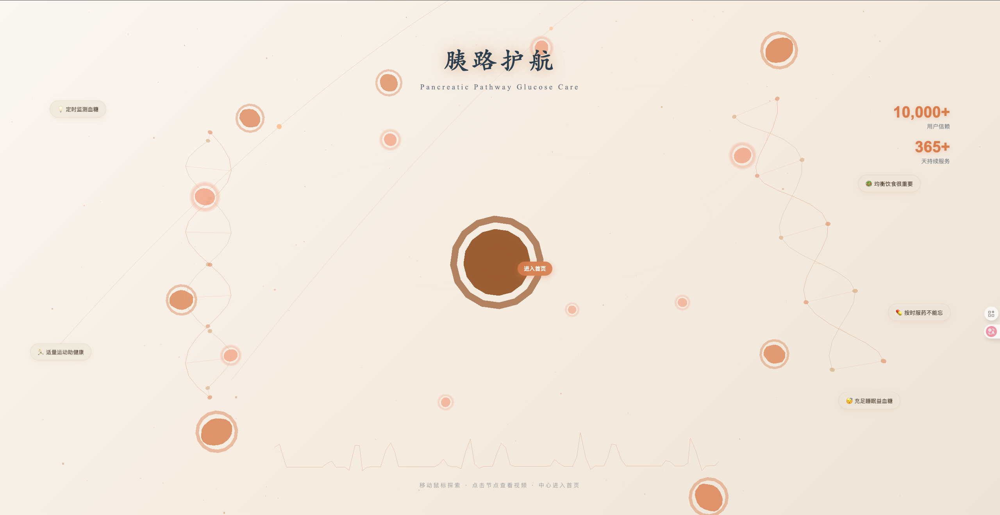
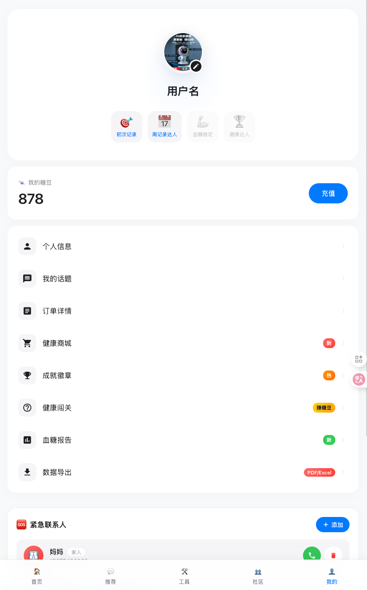

# 胰路护航 - 智能血糖管理系统

<div align="center">


<!-- 方案2: 如果视频文件在项目中 -->
<!--  -->

<!-- 方案3: 使用 GitHub 的视频预览 -->

<video controls src=".assets/web主界面演示.mp4" title="web演示"></video>


**基于 AI 技术的个性化控糖系统**

[](https://www.python.org/)
[](https://www.djangoproject.com/)
[](https://vuejs.org/)
[](LICENSE)

</div>

## 📖 项目简介

胰路护航是一款基于 AI 技术的个性化控糖系统，旨在应对全球日益严峻的糖尿病管理挑战。系统通过引入糖尿病知识图谱和 AI 技术，为不同患者提供个性化辅助治疗方案，提升治疗依从性。

### 🏆 获奖情况
- 获得 "知糖助手平台 V1.0" 计算机软件著作权
- 传智杯全国 IT 技能大赛 Web 网页开发挑战赛 B 组**国赛一等奖**

## ✨ 核心特性

### 🤖 AI 核心算法

#### 1. 个性化控糖 DSACPRA 算法
- **LSTM 长短期记忆网络**：捕捉血糖波动、用药时间等长序列数据的时序特征
- **协同过滤模块**：挖掘相似患者群体的健康数据特征与行为模式
- **多层感知机 (MLP)**：处理多维复杂数据，生成个性化推荐结果

#### 2. 知识图谱赋能 Deepseek 精准问答算法
- **检索增强生成 (RAG)**：结合知识图谱实现精准高效的 AI 问答服务
- **Neo4j 图数据库**：存储糖尿病专业知识
- **Deepseek-R1 模型**：提供专业详细的医学信息回答

### 🌐 多端支持

#### Web 端功能
- 🏥 **医疗资源整合**：医院定位、搜索等医疗帮助功能
- 🧠 **知识图谱 AI 问答**：专业糖尿病知识咨询
- 🍎 **饮食建议**：个性化营养推荐
- 👥 **社交互动**：患者社区交流平台

#### 移动端功能
- 📊 **健康数据管理**：血糖、运动、用药记录
- 🤖 **AI 智能问答**：24/7 健康咨询服务
- ⚠️ **血糖预警**：实时监控异常提醒
- 💰 **便捷充值**：账户管理和虚拟币系统



#### 硬件机器人 - 知糖小助手
- 🗣️ **多语言交互**：语音对话功能
- 🧠 **上下文记忆**：连贯对话体验
- 📡 **双模网络接入**：稳定网络连接

## 🏗️ 技术架构

### 后端技术栈
- **框架**：Django 3.2 + Django REST Framework
- **数据库**：MySQL + Redis + Neo4j
- **AI 模型**：DeepSeek API + 通义千问 API + Coze API
- **任务队列**：Celery
- **云存储**：阿里云 OSS
- **支付**：支付宝沙箱

### 前端技术栈
- **Web 端**：Vue.js 3 + Vite + Three.js
- **移动端**：原生 HTML5 + JavaScript
- **UI 框架**：自定义响应式设计
- **3D 效果**：Three.js 粒子系统和知识图谱可视化

### 数据安全
- **加密算法**：AES-256 加密
- **密钥管理**：分层管理体系
- **环境变量**：敏感信息环境变量化

## 🚀 快速开始

### 环境要求
- Python 3.9+
- Node.js 16+
- MySQL 8.0+
- Redis 6.0+

### 后端部署

1. **克隆项目**
```bash
git clone https://github.com/gogogo-a/blood.git
cd blood-sugar-management/backed/Blood_Sugar
```

2. **安装依赖**
```bash
pip install -r requirements.txt
```

3. **配置环境变量**
```bash
cp .env.example .env
# 编辑 .env 文件，配置数据库、API 密钥等
```

4. **数据库迁移**
```bash
python manage.py makemigrations
python manage.py migrate
```

5. **创建管理员**
```bash
python manage.py shell < scripts/init_admin.py
```

6. **启动服务**
```bash
python manage.py runserver 0.0.0.0:8000
```

### 前端部署

#### Vue.js Web 端
```bash
cd frontend/web_blood
npm install
npm run dev  # 开发环境
npm run build  # 生产环境
```

#### 静态 HTML 移动端
```bash
cd frontend/blood_html
# 直接部署到 Web 服务器即可
```

## 📁 项目结构

```
blood-sugar-management/
├── backed/Blood_Sugar/          # Django 后端
│   ├── Blood_Sugar/            # 项目配置
│   ├── User/                   # 用户管理
│   ├── app/                    # 核心应用（血糖记录、AI问答）
│   ├── Details/                # 内容管理（文章、食物）
│   ├── payments/               # 支付模块
│   ├── shop/                   # 健康商城
│   ├── tools/                  # 工具模块（GI查询等）
│   ├── quiz/                   # 健康问答
│   ├── goals/                  # 目标管理
│   ├── checkin/                # 打卡模块
│   ├── robot/                  # 硬件机器人接口
│   ├── utils/                  # 工具类
│   ├── scripts/                # 脚本文件
│   └── requirements.txt        # Python依赖
├── frontend/
│   ├── web_blood/              # Vue.js Web端
│   │   ├── src/
│   │   │   ├── views/          # 页面组件
│   │   │   ├── components/     # 通用组件
│   │   │   ├── api/            # API接口
│   │   │   └── assets/         # 静态资源
│   │   └── package.json
│   └── blood_html/             # 移动端HTML
│       ├── css/                # 样式文件
│       ├── js/                 # JavaScript文件
│       └── *.html              # 页面文件
└── README.md
```

## 🔧 配置说明

### 环境变量配置
详细的环境变量配置请参考 `backed/Blood_Sugar/.env.example` 文件：

- **数据库配置**：MySQL 连接信息
- **Redis 配置**：缓存和消息队列
- **AI API 配置**：DeepSeek、通义千问、Coze API 密钥
- **云服务配置**：阿里云 OSS、支付宝等
- **邮件配置**：SMTP 邮件服务

### 安全检查
运行安全检查脚本确保配置正确：
```bash
cd backed/Blood_Sugar
python scripts/security_check.py
```

## 📊 功能模块

### 🏥 医疗帮助
- **医院定位**：基于地理位置的医院搜索
- **药物查询**：糖尿病相关药物信息
- **知识图谱**：交互式糖尿病知识可视化
- **文档资料**：专业医学文献

### 🤖 AI 智能服务
- **个性化推荐**：基于用户数据的饮食运动建议
- **智能问答**：24/7 专业健康咨询
- **血糖预测**：基于历史数据的趋势分析
- **异常预警**：实时监控和提醒

### 📱 用户管理
- **健康档案**：完整的个人健康数据
- **数据记录**：血糖、运动、用药日志
- **目标设定**：个性化健康目标管理
- **社区互动**：患者经验分享平台

### 🛒 增值服务
- **健康商城**：糖尿病相关产品
- **虚拟币系统**：积分奖励机制
- **会员等级**：差异化服务体验
- **支付系统**：安全便捷的在线支付

## 🎯 商业模式

- **订阅服务**：高级功能会员制
- **硬件销售**：知糖小助手设备
- **数据增值服务**：健康数据分析报告
- **医疗合作**：与医疗机构合作付费服务
- **广告与品牌合作**：健康品牌推广

## 🔮 未来规划

### 短期目标
- [ ] 增加更多 AI 模型支持
- [ ] 优化移动端用户体验
- [ ] 扩展硬件设备功能
- [ ] 增强数据安全措施

### 长期愿景
- [ ] 覆盖糖尿病管理全流程
- [ ] 实现健康数据共享协作
- [ ] 引入医生角色模块
- [ ] 并发症监测与预防
- [ ] 嵌入式硬件智能监控

## 👥 开发团队

- **耿浩** - 项目负责人 & 后端开发
- **李悦欣** - 前端开发 & UI设计
- **刁丽娟老师** - 指导老师

## 🤝 合作支持

### 学术合作
- **学校信息中心**：服务器和实验室支持
- **廊坊疾控中心**：数据合作
- **滨州医学院公共卫生学院**：吕鹏教授团队合作

### 应用部署
- 社区医院应用部署
- 医疗机构试点运行

## 📞 联系我们

- **开发者**：耿浩
- **QQ**：2790159865
- **邮箱**：2790159865@qq.com
- **项目地址**：[GitHub Repository](https://github.com/gogogo-a/blood.git)

## 📄 许可证

本项目采用 MIT 许可证 - 查看 [LICENSE](LICENSE) 文件了解详情。

## 🙏 致谢

感谢所有为本项目提供支持的老师、同学和合作伙伴，特别感谢：
- 指导老师刁丽娟的专业指导
- 学校团委的资源保障
- 合作医疗机构的临床数据支持
- 参与测试用户的宝贵反馈

---

<div align="center">

**让科技守护健康，让 AI 助力控糖** 💙

</div>