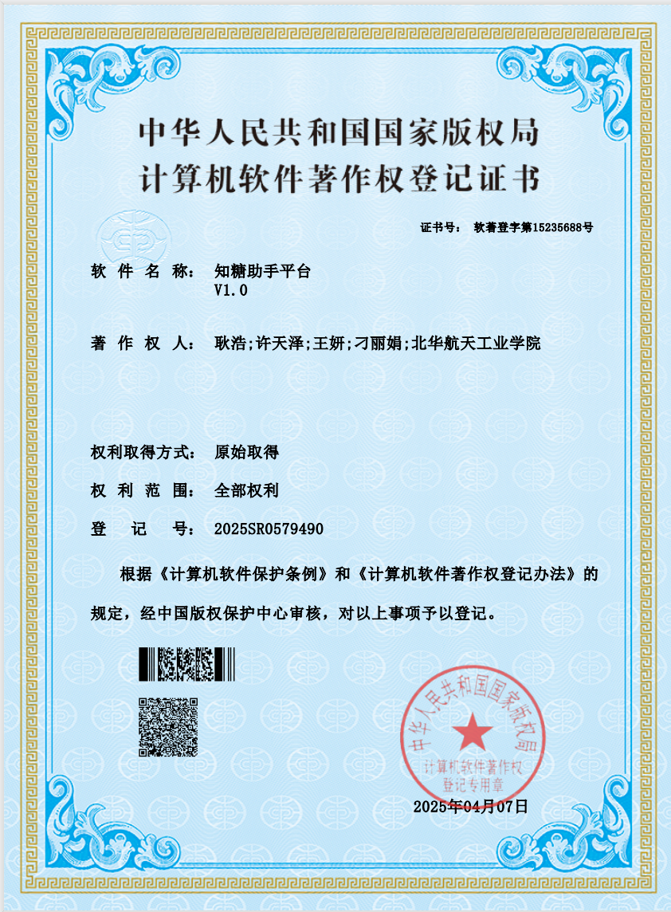
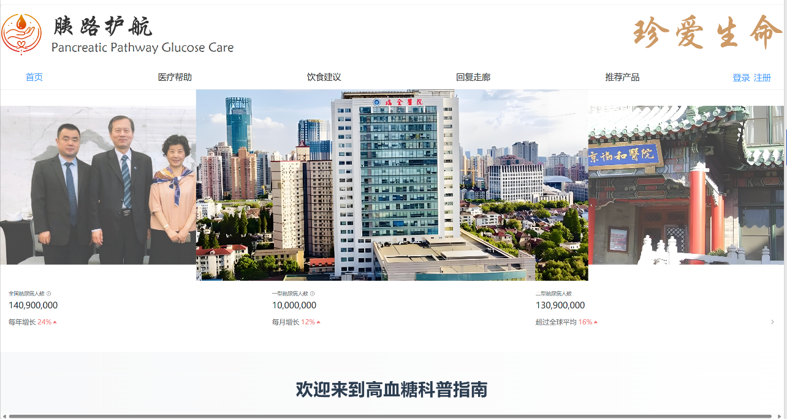
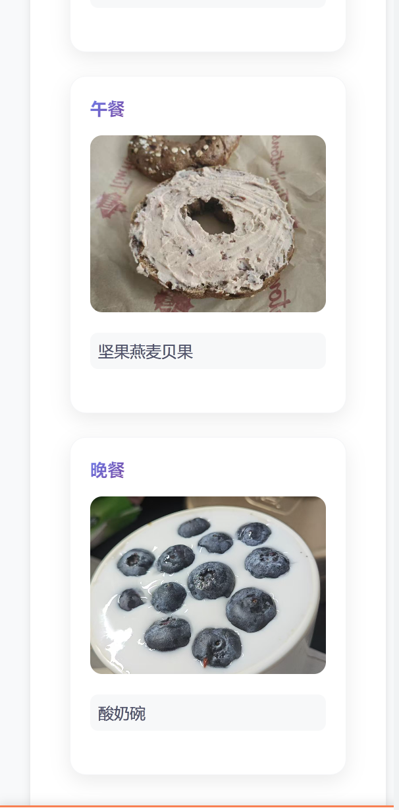
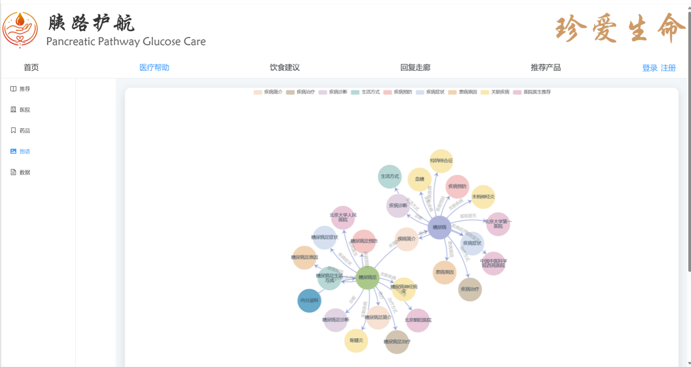
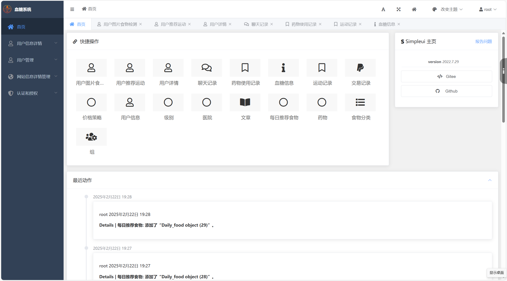
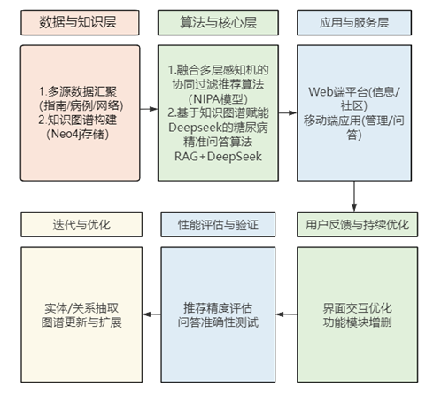

# 智护血糖 - AI 个性化控糖系统

<div align="center">

**慢病管理视角下的 AI 个性化控糖平台**

[](https://www.python.org/)
[](https://www.djangoproject.com/)
[](https://vuejs.org/)
[](https://www.mysql.com/)
[](https://neo4j.com/)

</div>

## 项目概览

智护血糖是一套面向糖尿病慢病管理场景的 AI 个性化控糖系统，覆盖 Web 信息平台、移动端健康管理、后台管理和智能问答服务。系统围绕“数据记录 - 个性化推荐 - 专业问答 - 持续反馈”的闭环，帮助用户记录血糖、饮食、运动、用药等健康数据，并基于知识图谱和大模型能力提供控糖建议。

这个项目来自校园竞赛与科研实践，我主要承担后端全栈和 AI 应用落地相关工作，包括 Django 后端业务、功能联调、用户健康数据管理、AI 问答与推荐能力接入、后台管理能力，以及 Web 端和移动端功能协同。

## 演示视频

[点击查看项目演示视频](https://blood-sugar.oss-cn-beijing.aliyuncs.com/%E6%BC%94%E7%A4%BA%E8%A7%86%E9%A2%91.mp4)

## 项目成果

- 传智杯全国 IT 技能大赛 Web 网页开发挑战赛 B 组国赛一等奖
- 获得“知糖助手平台 V1.0”计算机软件著作权
- 完成 Web 端、移动端、后台管理端和 AI 问答能力的完整闭环
- 结合糖尿病知识图谱、DeepSeek 问答和个性化推荐算法，探索慢病管理场景下的 AI 应用落地



## 我的职责

- 负责 Django 后端核心业务设计，完成用户、健康记录、文章内容、医院药品、商城支付、积分打卡等模块的数据管理和服务能力。
- 负责 AI 问答与个性化推荐相关能力接入，围绕糖尿病知识图谱、DeepSeek、饮食运动推荐构建可落地的服务流程。
- 负责 Web 端、移动端和后台管理端的功能联调，保证用户侧记录、问答、推荐、充值、社区互动和管理侧内容维护能够形成完整链路。
- 参与项目文档、竞赛材料和演示内容整理，将系统背景、技术路线、成果证明和产品功能统一成可展示的校园项目经历。

## 核心功能

### Web 信息平台

- 糖尿病科普内容和前沿资讯展示
- 医院、医生、药品等医疗资源查询
- 糖尿病知识图谱可视化
- 饮食建议、推荐产品和社区交流入口



### 移动端健康管理

- 血糖、运动、用药等日常健康数据记录
- 近 7 天血糖趋势和个人健康状态展示
- 饮食推荐、图片识别和个性化控糖建议
- 充值、订单、社区发帖、评论互动等用户功能



### AI 智能问答

- 构建糖尿病领域知识图谱，沉淀疾病、症状、药品、检查项目、并发症等知识关系
- 结合 DeepSeek 大模型和检索增强生成思路，为用户提供更贴合糖尿病场景的问答结果
- 在通用问答之外引入专业知识约束，降低垂直医疗健康场景中的回答偏差



### 后台管理

- 用户、血糖、运动、用药、聊天记录等数据管理
- 医院、药品、文章、每日推荐食物等内容维护
- 价格策略、交易记录和用户等级管理
- 管理端操作记录留存，方便追踪内容维护和业务数据变化



## 技术架构



### 后端

- Django 3.2 + Django REST Framework
- MySQL 存储核心业务数据
- Redis 支撑缓存和异步任务场景
- Neo4j 存储糖尿病知识图谱
- Celery 处理后台任务
- 阿里云 OSS 管理演示视频和媒体资源

### 前端

- Vue 3 + Vite 构建 Web 端
- Element Plus、ECharts、Three.js 支撑后台组件、数据可视化和图谱展示
- 原生 HTML5 + JavaScript 构建移动端页面
- Axios 统一处理前后端数据通信

### AI 能力

- NIPA 个性化控糖推荐思路：结合协同过滤和多层感知机，对患者健康特征与控糖方案进行适配度建模
- 知识图谱问答：围绕糖尿病专业知识构建实体关系，并与 DeepSeek 问答能力结合
- 图像识别与饮食建议：面向移动端饮食记录和控糖推荐场景，辅助用户理解食物含糖风险

## 本地运行

### 环境要求

- Python 3.9+
- Node.js 16+
- MySQL 8.0+
- Redis 6.0+
- Neo4j

### 后端服务

```bash
cd backed/Blood_Sugar
pip install -r requirements.txt
cp .env.example .env
python manage.py migrate
python manage.py runserver 0.0.0.0:8000
```

### Web 端

```bash
cd frontend/web_blood
npm install
npm run dev
```

### 移动端页面

```bash
cd frontend/blood_html
```

移动端为静态页面，可部署到 Web 服务器后访问。

## 项目结构

```text
blood_sugar/
├── backed/Blood_Sugar/       # Django 后端服务
├── frontend/web_blood/       # Vue Web 端
├── frontend/blood_html/      # 移动端静态页面
├── .assets/readme/           # README 展示素材
└── README.md
```

## 后续可扩展方向

- 接入更多真实血糖设备，提升血糖数据采集的连续性
- 强化个性化推荐模型，让饮食、运动和用药提醒更贴合不同用户状态
- 扩展医生端或机构端能力，支持医生查看授权后的健康趋势与问答记录
- 增强隐私保护、权限控制和数据脱敏流程，让系统更适合医疗健康场景长期使用

## 项目信息

- 项目负责人：耿浩、李悦欣、陈千山
- 指导老师：刁丽娟
- 学校：北华航天工业学院
- 仓库地址：[https://github.com/gogogo-a/blood.git](https://github.com/gogogo-a/blood.git)
- 许可证：[MIT](LICENSE)
